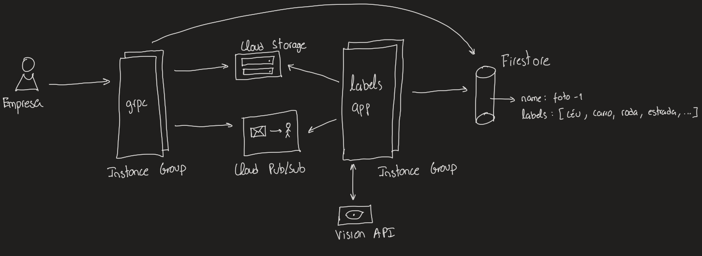
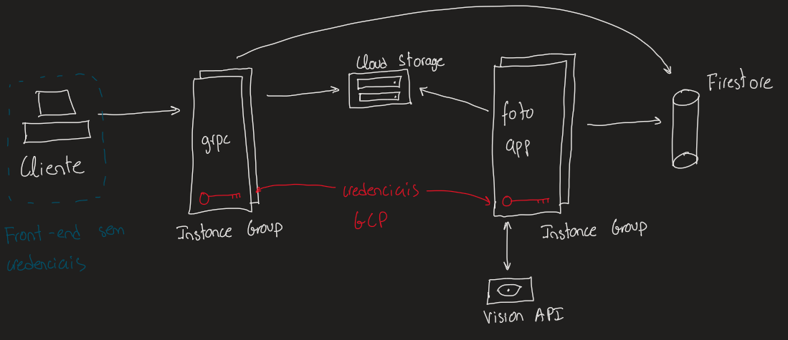

# 9

## a
````java

/*
* Operação que registra um point of sale no sistema.
* Cliente: Fornecer o identificador do POS.
* Servidor: Regista o POS no Firestore e retorna um Void.
*/
rpc registerPOS (POSid) returns (Void);

/*
* Operação que registra cada venda feita num point of sale.
* Cliente: Fornece uma stream de vendas.
* Servidor: Regista cada venda no Firestore e retorna um Void.
*/
rpc reportPOSsales (stream Sale) returns (Void);

/*
* Operação que retorna todas as vendas feitas num point of sale.
* Cliente: Fornecer o identificador do POS.
* Servidor: Retorna uma stream de vendas as quais estão registadas no Firestore com o identificador do POS fornecido.
*/
rpc getAllPOSsales (POSid) returns (stream Sale);
````


## b
````java
package grpcserverapp;

// imports

public class GrpcServer {

    private static int SERVER_PORT = 8000;

    public static void main(String[] args) {
        try {
            if (args.length > 0) SERVER_PORT = Integer.parseInt(args[0]);

            io.grpc.Server svc = ServerBuilder.forPort(SERVER_PORT)
                    .addService(new POSProcessor())
                    .build();

            svc.start();
            System.out.println("Server started on port " + SERVER_PORT);

            Runtime.getRuntime().addShutdownHook(new ShutdownHook(svc));
            svc.awaitTermination();
        } catch (Exception ex) {
            System.err.println("An error occurred: " + ex.getMessage());
        }
    }
}
````

````java
package grpcserverapp;

// imports

public class POSProcessor extends POSServiceGrpc.POSServiceImplBase {

    private Firestore firestore = FirestoreOptions.getDefaultInstance().getService();

    @Override
    public void registerPOS (POSId request, StreamObserver<Void> responseObserver) {
        // DocumentReference docRef = firestore.collection("POS").document(request.getPOSId());

        // Map<String, Object> data = new HashMap<>();
        // data.put("sales", new ArrayList<>());
        
        // ApiFuture<WriteResult> result = docRef.set(data);
        
        // responseObserver.onNext(Void.getDefaultInstance());
        // responseObserver.onCompleted();
    }

    @Override
    public StreamObserver<Sale> reportPOSsales (StreamObserver<Void> responseObserver) {
        return new StreamObserver<Sale>() {
            @Override
            public void onNext(Sale value) {
                DocumentReference docRef = firestore.collection("POS").document(value.getPOSId());
                
                ArrayList<Sale> saleArray = new ArrayList<>();

                // Pair<Description, TotalPrice>
                Pair<String, Float> sale = new Pair<>(value.getDescription(), value.getTotalPrice());
                saleArray.add(sale);

                ApiFuture<WriteResult> result = docRef.updated("sales", FieldValue.arrayUnion(saleArray));
            }

            @Override
            public void onError(Throwable t) {
                System.out.println("Error on reportPOSsales");
            }

            @Override
            public void onCompleted() {
                responseObserver.onNext(Void.getDefaultInstance());
                responseObserver.onCompleted();
            }
        };
    }

    @Override void getAllPOSsales (POSid request, StreamObserver<Sale> responseObserver) {
        // DocumentReference docRef = firestore.collection("POS").document(request.getPOSId());
        
        // ApiFuture<DocumentSnapshot> future = docRef.get();
        // DocumentSnapshot document = future.get();

        // List<Pair<String, Float>> sales = (List<Pair<String, Float>>) document.get("sales");

        // for (Pair<String, Float> sale : sales) {
        //     Sale saleMessage = Sale.newBuilder()
        //             .setDescription(sale.getKey())
        //             .setTotalPrice(sale.getValue())
        //             .build();
        //     responseObserver.onNext(saleMessage);
        // }
    }
}
````

## c
````java
public class POSapp {
    private static String svcIP = "localhost";
    private static int svcPort = 8000;
    private static ManagedChannel channel;
    private static POSServiceGrpc.POSServiceBlockingStub blockingStub;
    private static POSServiceGrpc.POSServiceStub noBlockStub;


    public static void main(String[] args) {
        try {
            if (args.length == 2) {
                svcIP = args[0];
                svcPort = Integer.parseInt(args[1]);
            }
            System.out.println("connected to " + svcIP + ":" + svcPort);
            channel = ManagedChannelBuilder.forAddress(svcIP, svcPort)
                    .usePlaintext()
                    .build();

            blockingStub = POSServiceGrpc.newBlockingStub(channel);
            noBlockStub = POSServiceGrpc.newStub(channel);

            Int posID = 123;
            
            getAllPOSsales(posID);

            Thread.sleep(10000); // 10 seconds

            channel.shutdown();
        } catch (Exception ex) {
            System.out.println("Unhandled exception");
            ex.printStackTrace();
        }
    }

    // static void registerPOS(int posID) {
    //     POSId request = POSId.newBuilder().setPOSId(posID).build();

    //     blockingStub.registerPOS(request);
    // }

    // static void reportPOSsales(int posID, String description, float totalPrice) {
    //     StreamObserver<Sale> requestObserver = noBlockStub.reportPOSsales(new StreamObserver<Void>() {
    //         @Override
    //         public void onNext(Void value) {
    //             System.out.println("Sale reported");
    //         }

    //         @Override
    //         public void onError(Throwable t) {
    //             System.out.println("Error on reportPOSsales");
    //         }

    //         @Override
    //         public void onCompleted() {
    //             System.out.println("reportPOSsales completed");
    //         }
    //     });
        
    //     Sale sale = Sale.newBuilder()
    //             .setPOSId(posID)
    //             .setDescription(description)
    //             .setTotalPrice(totalPrice)
    //             .build();

    //     requestObserver.onNext(sale);
    // }

    static void getAllPOSsales(int posID) {
        POSId request = POSId.newBuilder().setPOSId(posID).build();

        noBlockStub.getAllPOSsales(request, new StreamObserver<Sale>() {
            @Override
            public void onNext(Sale value) {
                System.out.println("Sale:");
                System.out.println("Description: " + value.getDescription());
                System.out.println("Total Price: " + value.getTotalPrice());
            }

            @Override
            public void onError(Throwable t) {
                System.out.println("Error on getAllPOSsales");
            }

            @Override
            public void onCompleted() {
                System.out.println("getAllPOSsales completed");
            }
        });
    }
}
````

# 10
````
Serviço de armazenamento dos ficheiros (.jpg) -> Usar o Google Cloud Storage para armazenar os ficheiros .jpg.

Serviço de Catalogação das fotos -> Usar o Google Cloud Vision para catalogar as fotos armazenadas no Google Cloud Storage.

Base de dados -> Usar o Google Cloud Firestore para armazenar as fotos catalogadas.

Teremos um servidor gRPC que irá comunicar com os serviços de armazenamento e irá publicar uma mensagem num tópico (FotosToProcess) sempre que uma foto for armazenada. Para a empresa poder ter acesso às imagens catalogadas, também será o servidor grpc responsável por interagir com o Firestore. Este servidor estará dentro de um instance group.

Para interagir com a API do Google Cloud Vision, iremos criar uma aplicação "Labels App" que irá subscrever ao tópico para onde o servidor gRPC publica as mensagens, assim sempre que houver uma nova mensagem, a "labels app" irá aceder ao Google Cloud Storage para obter a foto e irá enviar a foto para o Google Cloud Vision para obter as labels. As informações serão guardadas no Google Cloud Firestore. A aplicação estará também por sua vez dentro de um instance group.

No firestore, as fotos catalogadas serão guardadas da seguinte forma:
- Cada foto terá um documento com o nome da foto e as respetivas labels.
- As labels serão guardadas num array de strings.
````

<div align="center">



</div>

# 11

````
a) Concordo. O facto de ter várias máquinas virtuais para lidar com as operações permite que o sistema consiga fazer uma melhor distribuição de carga, melhorando a eficiência e reduzindo o tempo de resposta.

b) Concordo. Desacoplar o front-end dos serviços da plataforma GCP permite o sistema desenvolvido ter credenciais ou sessão iniciada para poder usufruir da aplicação (uma vez que se trata dum projeto académico). Para tal quem de facto precisa das credenciais são os servidores gcp (usam o Google Cloud Storage para armazenar as imagens) e as instâncias das APP que irão processar as fotos (acedem ao Google Cloud Storage e usam a API Vision), uma vez que estas sim interagem com o serviços da plataforma GCP.

c) Discordo. Ter as máquinas vms que contêm a parte de processamento de fotos num instance group, permite que haja escalabilidade em relação ao número de instâncias e que, no caso de não existirem pedidos de clientes, com ou sem escalabilidade automática (pode também ser controlada por uma aplicação) pode-se reduzir o número ou até mesmo colocar a 0 o número de instâncias consoante uma dada métrica (e.g. % de CPU usada).
````

<div align="center">



</div>