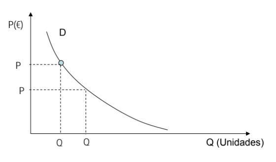

# __Economia__

## __Cálculo das Elasticidades__

* __Elasticidade rígida__  -> $ E_x < 1 $
* __Elasticidade elástica__ -> $ E_x > 1 $

Escolher um valor para o  ``Q`` para calcular a elasticidade (__geralmente um valor que a outra coordenada seja 0__).

### __Elasticidade do Preço-Procura__

$ E_d = - (\frac{\Delta Q}{\Delta P} \times \frac{P.E}{\overline{Q}}) $

### __Elasticidade do Preço-Oferta__

$ E_s = \frac{\Delta Q}{\Delta P} \times \frac{P.E}{Q} $

## __Cálculo do Preço de Equilíbrio__

Apartir das 2 funções da curva da procura e da oferta, __igualam-se as mesmas e isola-se a variável P__. Tendo o valor de P, __substitui-se numa das funções__ para obter o valor de Q, obtendo assim o __Preço de Equilíbrio (P, Q)__.

## __Cálculo da Despesa dos consumidores__

$ D_c = P * Q $, no Preço de Equilíbrio

## __Cálculo do PIB__

* __PIB Nominal__ -> PIB a preços correntes
* __PIB Real__ -> PIB a preços de mercado constantes

### __PIBpm__

$ PIBpm = C + G + I + Ex - Im $

* __C__ -> Consumo Privado
* __G__ -> Consumo Público
* __I__ -> Investimento
* __Ex__ -> Exportações
* __Im__ -> Importações
* __Exportações Líquidas__ -> Ex - Im

### __PIBcf__

$ PIBcf = PIBpm - Ti + Z $

* __Ti__ - Impostos Indiretos
* __Z__ - Subsídios à Produção

## __Cálculo do PNB__

### __PNBpm__

$ PNBpm = PIBpm + REX $

* __REX__ -> Rendimentos Recebidos do Resto do Mundo (__RRRM__) - Rendimentos Pagos ao Resto do Mundo (__RPRM__)

### __PNBcf__

$ PNBcf = PNBpm - Ti + Z $

## __Cálculo dos Deflatores__

$ Deflactor = \frac{Valor Nominal}{Valor Real} $

## __Cálculo dos Rendimentos__

### __Rendimento Nacional__

$ RN = PNLcf = PNBcf - A $

* __A__ -> Amortizações

### __Rendimento Disponível__

$ RD = RN - T + TR + RE $

* __T__ -> Impostos Directos
* __TR__ -> Transferências do Estado para as Famílias (Internas)
* __RE__ -> Traferências Externas para Particulares

## __Cálculo da Poupança__

$ S = RD - C $

## __Cálculo dos Saldos__

### __Saldo Orçamental__

$ SO = T + Ti + $ Seg. Social $ - \ G - TR - $ Juros dívida Pública - Subsídios à Produção $

### __Saldo da Balança de Transações Correntes__

$ BTC = Ex - Im + REX - RE $