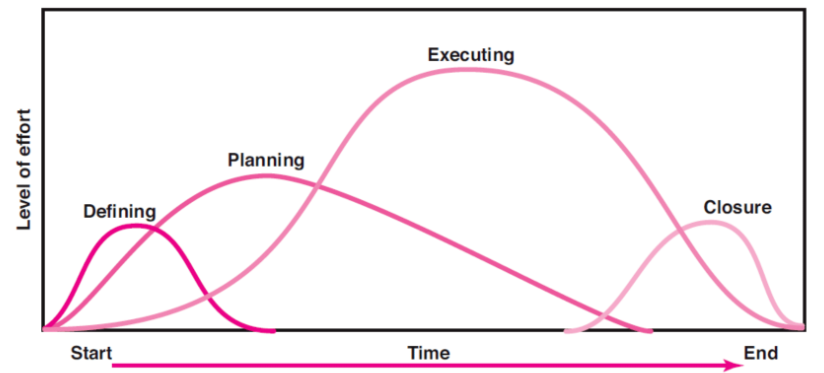
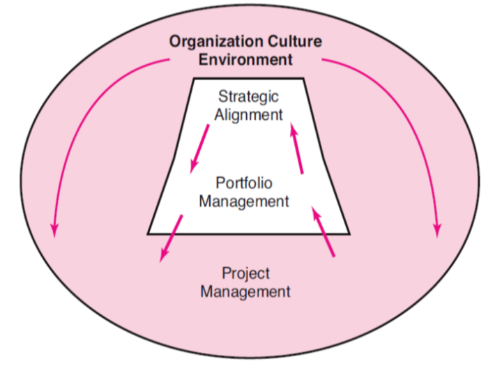
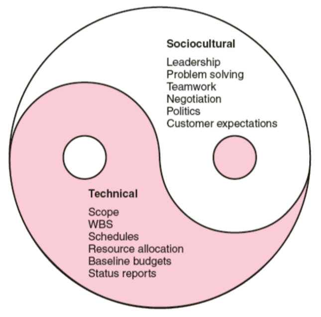

# __Introdução__

## __O que é um Projeto?__

Esforço complexo, não rotineiro, único, limitado pelo tempo, custo e recursos, que é realizado para atingir um objetivo específico.

### __Características__ de um projeto:

* Tem um __objetivo establecido__;

* Tem um tempo definido com um __começo e fim__;

* Tem tempo, custos e recursos __específicos__;

* Necessita de __organização a vários níveis__;

* Involve __fazer algo que nunca foi feito antes__;

## __Programas vs Projetos__

__Conjunto de projetos coordenados e interligados__ que continuam por um longo período de tempo e que são necessários para atingir um objetivo específico.

__E.g.__:
* Projeto -> Completar uma cadeira de um curso;
* Programa -> Completar um curso.

## __Rotinas vs Projetos__

__Rotinas__ são atividades que são realizadas de forma __repetitiva__ e __contínua__.

__E.g.__:
* Rotina -> Praticar aulas de piano;
* Projeto -> Preparar um concerto.

## __Tempo de Vida de um Projeto__

## ___Project Manager___

__Gere temporariamente atividades de um projeto__ e frequentemente age independentemente da estrutura organizacional.

### __Responsabilidades__:

* Gere os __recursos do projeto__;

* Diretamente __ligado ao cliente__;

* Responsável por __coordenar e integrar a equipa do projeto__, sendo então __responsável pelo sucesso ou fracasso do projeto__.

## __Importância da Gestão de Projetos__

* Aumento do focus no __cliente__;

* Compressão dos __ciclos de vida dos produtos__;

* Melhor eficiência na __utilização dos recursos__;

## __Gestão de Projetos Integrada__

### __Benefícios__

* Melhor __gestão do risco__ dos projetos;

* __Visão global dos projetos__ e de como estão organizados;

### __Problemas__

* __Díficil de priorizar projetos__ pela importância e contribuição para a organização;

### ___Portfolio Management___

* Gere a __seleção e priorização de projetos__.

* __Balanceia os projetos__ no portfolio de modo a __representar o nível de risco__ apropiado para a organização.

* Melhora a gestão de projetos e a __eficiência da organização__.

## __Dimensões Técncicas e Socioculturais da Gestão de Projetos__

