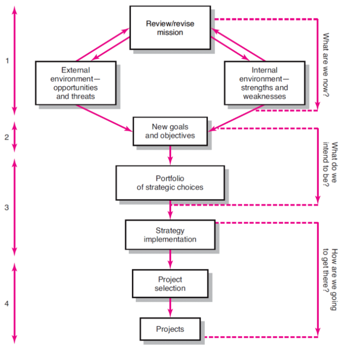

# __Estratégia__

## __Projetos e Estratégia__

__Erros__ causados por __falta de conhecimento__ da função do __projeto na estratégia da organização__:

* Focar nos __problemas ou soluções__ com prioridade __estratégica baixa__;

* Focar no __consumidor imediato__ em vez de o __mercado todo__;

* Focar numa __perfeição técnica__ que apenas a __equipa de projeto entende__.

* Dar __demasiada êmfase a tecnologias__ que resultam em projetos que vão __contra a estratégia da organização__ ou não são aplativos para o __consumidor__.

## __Processo de Gestão Estratégica__

* Rever e definir a __missão e objetivos da organização__;

* Definir __objetivos a longo prazo__;

* Analisar e formular __estratégias__ para atingir os __objetivos__;

* Implementar as __estratégias__ através de __projetos__;

### __Características dos Objetivos__

* _Specific_ (__específico__);

* _Measurable_ (__mensurável__);

* _Assignable_ (__atribuível__);

* _Realistic_ (__realista__);

* _Time-related_ (__temporal__).

## __Problemas da__ ___Project Portfolio Management___

* Lacuna entre __estratégia e execução__;

* __Políticas da organização__;

* Conflitos de __recursos__ e ___multi-tasking___;

## __Tipo de Projetos no Portfólio__

* ___Compliance___;

* __Estretégicos__;

* __Operacionais__;