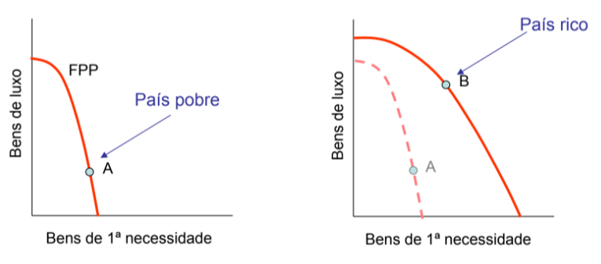
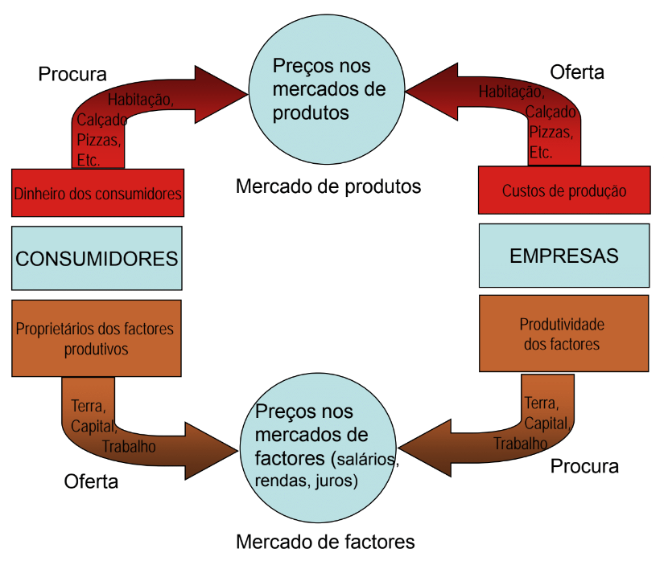
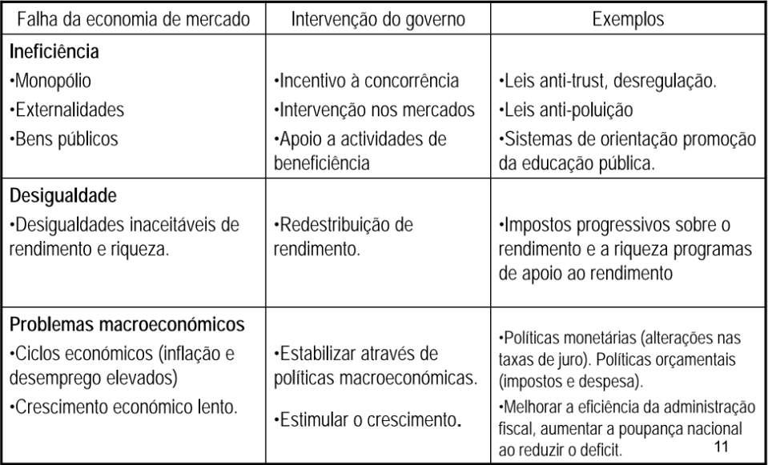
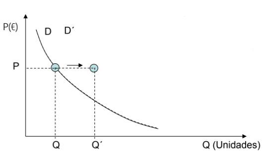
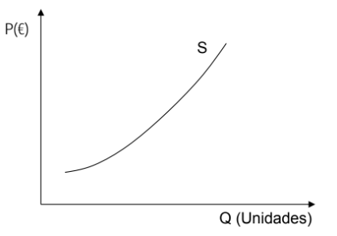
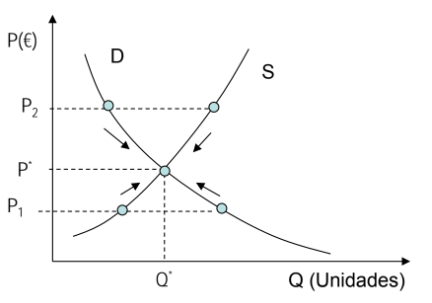

# __Economia__

## __Definição__

* Ciência que estuda:
    * A forma como as sociedades utilizam os recursos escassos para produzir bens com valor e de como os distribuem entre os diferentes Membros. 
    * Consumo dos bens e a repartição dos rendimentos.

* __Macro-economia__ -> Estuda o funcionamento da economia como um todo.

* __Micro-economia__ -> Estuda o __comportamento__ dos __componentes individuais__ (e.g. mercados, empresas, famílias, etc.).

#

## __Lei da Escassez__

Os __bens__ são __limitados__ enquanto que os __desejos__ são __infinitos__.

* __Eficiência__ -> Utilização mais efectiva dos recursos de uma sociedade na satisfacção dos desejos e das necessidades da população.

#

## __Problemas básicos da Economia__

* __Quais os bens a produzir e em que quantidades?__

* __Como são produzidos os bens?__

* __Para quem são produzidos os bens?__

#

## __Factores de Produção__

Bens ou serviços utilizados pela empresa no seu __processo de produção__.

* __Categorias__:
    * __Terra__ -> Recursos naturais.
    * __Trabalho__ -> Esforço humano.
    * __Capital__ -> Bens produzidos pelo homem.

* __Produções__ -> Vários bens e serviços que são consumidos ou utilizados para uma produção posterior.

#

## __Formas de resolver os problemas económicos__

* __Economia Dirigida__ -> O Governo toma todas as decisões acerca da produção e distribuição dos bens.

* __Economia de Mercado__ -> As decisões são tomadas pelos indivíduos e pelas empresas.

* __Economia Mista__ -> Combinação das economias dirigida e de mercado.

``A sociedade tem de encontrar o justo equilíbrio entre a disciplina do mercado e a generosidade dos programas dos governos.``

#

## __Economia Positiva/Objectiva__

Descreve e explica os factos de uma economia (causa/efeito) e recomenda políticas.

Economia __"do que é"__.

E.g.:
* O aumento do IVA irá aumentar as receitas fiscais?
* Qual o impacto dos computadores na produtividade?

#

## __Economia Normativa/Subjectiva__

Envolve __juízos de valor__ e __opiniões__.

Economia __"do que deve ser"__.

E.g.:
* Que nível de inflação é aceitável?
* Os ricos de deveriam pagar mais impostos do que os pobres em termos de percentagem do rendimento?

#

## __Fronteira das possibilidades de Produção__

Representa as quantidades máximas de produção que podem ser obtidas por uma economia, dados o seu conhecimento tecnológico e a quantidade de factores de produção disponíveis.

As __escolhas__ e os __investimentos__ no __presente__ terão __consequências__ no __futuro__.

* __Eficiência produtiva__ -> Acontece quando uma economia não pode produzir mais de um bem sem produzir menos de outro:

#

## __Mercado__

Mecanismo através do qual os compradores e vendedores se encontram para determinar os preços e trocar bens e serviços.

* __Concorrência Perfeita__ -> Mercado onde nenhuma empresa ou consumidor é suficientemente forte para afectar o preço de mercado.

#

## __Papel Económico do Governo__

Os mercados __não proporcionam__ necessariamente uma __repartição justa do rendimento__, para tal __os governos__ actuam com __medidas__ no sentido de __corrigir__ essas injustiças.

#

## __Função da Procura__

Relação entre o __preço__ e a __quantidade comprada__ de um bem.

* Lei da __Procura__:
    * __Preço__
    * Níveis médios de rendimento
    * Preços dos bens relacionados
    * Dimensão da população
    * Gostos e preferências dos consumidores

#

## __Variação da Procura__

A __variação__ do preço de um bem pode levar a uma variação da procura, fazendo com que a curva sofra um deslocamento.

* __E.g.__:

#

## __Função da Oferta__

Relação entre o __preço__ e a __quantidade produzida__ de um bem.

* Lei da __Oferta__:
    * __Lucro__
    * Custo de produção
    * Tecnologia

#

## __Variação da Oferta__

A __variação__ do preço de um bem pode levar a uma variação da oferta, fazendo com que a curva sofra um deslocamento.

* __E.g.__:

#

## __Equilíbrio de Mercado__

As __forças da procura e da oferta__ operam através do mercado para produzir um __equilíbrio de preço e quantidade__.

* Se o preço for $ P_1  \Rightarrow $ há excassez.

* Se o preço for $ P_2  \Rightarrow $ há excedente.

#

## __Elasticidade da Procura__

> $ E_d = - (\frac{\Delta Q}{\Delta P} \times \frac{P}{Q}) $

* __Procura rígida__:
    > A __variação do preço__ é __maior__ do que a __variação na quantidade procurada__.
    * $ E_d < 1 $
    * __E.g.__: Bens essenciais.

* __Procura elástica__:
    > A __variação do preço__ é __menor__ do que a __variação na quantidade procurada__.
    * $ E_d > 1 $
    * __E.g.__: Bens de luxo.

* __Procura unitária__ -> $ E_d = 1 $

* __Procura perfeitamente elástica__ -> $ E_d = \infty $

* __Procura perfeitamente rígida__ -> $ E_d = 0 $

* __Receita__:
    * Quando a procura é __rígida__, a __receita diminui__ com a __redução do preço__.
    * Quando a procura é __elástica__, a __receita aumenta__ com a __redução do preço__.

#

## __Elasticidade da Oferta__

> $ E_s = \frac{\Delta Q}{\Delta P} \times \frac{P}{Q} $

* __Oferta rígida__:    
    * Capacidade de produção fortemente limitada.
    * $ E_s < 1 $

* __Oferta elástica__:
    * Capacidade de produção é facilmente aumentada.
    * $ E_s > 1 $

* __Oferta unitária__ -> $ E_s = 1 $

* __Oferta perfeitamente elástica__ -> $ E_s = \infty $

* __Oferta perfeitamente rígida__ -> $ E_s = 0 $

#

## __Noção de Utilidade__

> Serve para explicar como os __consumidores racionais__ dividem os seus __recursos limitados__ entre os __bens finais__ que lhes __proporiconam satisfação__.

* __Utilidade Total__:
    * __E.g.__:

* __Utilidade Marginal Decrescente__:
    * __E.g.__: 

* __Condição de Equilíbrio__:
    > Quando a utilidade marginal por unidade monetária dispendida é igual para todos os bens.
    * $ \frac{UM_{bem1}}{P_1} = \frac{UM_{bem2}}{P_2} = \frac{UM_{bemi}}{P_i} $

Se o __preço__ de um bem __aumentar__, o __consumo__ desse bem irá __diminuir__ -> $ \frac{UM_{bem1}}{P_1} < \frac{UM_{bem2}}{P_2} = \dots = \frac{UM_{bemi}}{P_i}  = \dots $

Se o __preço__ de um bem __diminuir__, o __consumo__ desse bem irá __aumentar__ -> $ \frac{UM_{bem1}}{P_1} > \frac{UM_{bem2}}{P_2} = \dots = \frac{UM_{bemi}}{P_i}  = \dots $

#

## __Elasticidade de Rendimento__

> $ E_r = \frac{\Delta Q}{\Delta R} \times \frac{R}{Q} $

#

## __Produto__

* __Produto Interno Bruto (PIB)__:
    > Quantificação do valor de mercado de todos os bens e serviços finais produzidos num país no __período de um ano__.
    * __Nominal__ -> Medido com __preços correntes__ de mercado.
    * __Real__ -> Medido com __preços constantes__ de mercado (e.g. ano base).

#

## __Emprego__

* __Taxa de desemprego__
    > Percentagem da população activa desempregada.
    * __População activa__ -> __Pessoas empregadas__ e todas as que estão __desempregadas mas à procura de emprego__.

#

## __Establidade de Preços__

> Os preços não devem se alterar ou então crescer muito lentamente.

* __Índice de Preços ao Consumidor (IPC)__ -> Quantifica o __preço médio__ de um conjunto de bens e serviços (__cabaz__) comprados pelos __consumidores__.

* __Taxa de Inflação__ -> Variação percentual do __IPC__ de um ano para o outro.

#

## __Comércio Internacional__

Interessa ter uma __balança comercial positiva__ e também ao mesmo tempo as __taxas de câmbio estáveis__.

#

## __Política Orçamental__

> Gestão da moeda, crédito e do sistema bancário.

* __Despesa Pública__ -> __Compras do Estado__ (estradas, tanques, salários, etc.) e as __transferências do Estado__ que __ampliam os rendimentos__ de determinados grupos (desempregados, reformados, etc.).

* __Impostos__ -> __Receitas do Estado__.

#

## __Política Monetária__

* __Oferta de Moeda__ -> __Influencia__ várias __variáveis financeiras e económicas__, como taxas de juro, preço das acções, etc.

* __Restrição da Oferta de Moeda__ -> __Aumento__ das __taxas de juro__ e à __reduçao do investimento e do consumo__.

* __Expansão da Oferta de Moeda__ -> __Redução__ das __taxas de juro__ e ao __aumento do investimento e do consumo__.

#

## __Oferta Agregada__
> __Quantidade total de bens e serviços__ que as __empresas__ de um país que estão dispostas a __produzir e vender__ num dado __período de tempo__.	

* __Depende__:
    * __Nível de preços__;
    * __Capacidade produtiva__;
    * __Custos de produção__.

#

## __Procura Agregada__
> __Montante total__ que os __diferentes sectores da economia__ estão dispostos a __gastar__ num dado __período de tempo__.

* __Depende__:
    * __Soma da despesa dos consumidores, empresas e governo__;
    * __Nível de preços__;
    * __Política orçamental e monetária__.

#

## __Oferta e Procura Agregada__

#

## __Óptica da Produção__

* __Produto Nacional Bruto (PNB)__:
    > __PNB = PIB + REX__
    * __REX__ -> Rendimentos Recebidos do Resto do Mundo (__RRRM__) - Rendimentos Pagos ao Resto do Mundo (__RPRM__).

* __Produto Interno Líquido (PIL)__ -> __PIB__ - Amortizações (__A__).

* __Produto Nacional Líquido (PNL)__ -> __PNL = PNB - A__.    

* __PIB a preços de mercado (PIBpm)__ -> PIB a custos de fatores (__PIBcf__) + Impostos indiretos (__Ti__) - subsídios à produção (__Z__).

#

## __Óptioca da Despesa__