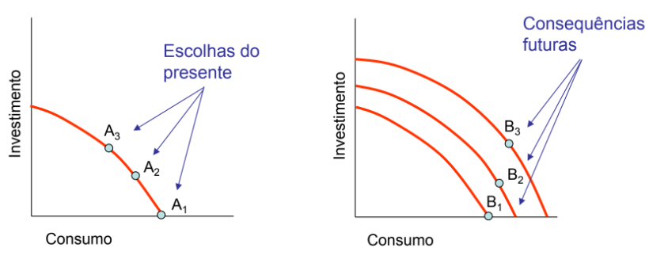

# __Economia__

## __Definição__

* Ciência que estuda:
    * A forma como as sociedades utilizam os recursos escassos para produzir bens com valor e de como os distribuem entre os diferentes Membros. 
    * Consumo dos bens e a repartição dos rendimentos.

* __Macro-economia__ -> Estuda o funcionamento da economia como um todo.

* __Micro-economia__ -> Estuda o __comportamento__ dos __componentes individuais__ (e.g. mercados, empresas, famílias, etc.).

#

## __Lei da Escassez__

Os __bens__ são __limitados__ enquanto que os __desejos__ são __infinitos__.

* __Eficiência__ -> Utilização mais efectiva dos recursos de uma sociedade na satisfacção dos desejos e das necessidades da população.

#

## __Problemas básicos da Economia__

* __Quais os bens a produzir e em que quantidades?__

* __Como são produzidos os bens?__

* __Para quem são produzidos os bens?__

#

## __Factores de Produção__

Bens ou serviços utilizados pela empresa no seu __processo de produção__.

* __Categorias__:
    * __Terra__ -> Recursos naturais.
    * __Trabalho__ -> Esforço humano.
    * __Capital__ -> Bens produzidos pelo homem.

* __Produções__ -> Vários bens e serviços que são consumidos ou utilizados para uma produção posterior.

#

## __Formas de resolver os problemas económicos__

* __Economia Dirigida__ -> O Governo toma todas as decisões acerca da produção e distribuição dos bens.

* __Economia de Mercado__ -> As decisões são tomadas pelos indivíduos e pelas empresas.

* __Economia Mista__ -> Combinação das economias dirigida e de mercado.

``A sociedade tem de encontrar o justo equilíbrio entre a disciplina do mercado e a generosidade dos programas dos governos.``

#

## __Economia Positiva/Objectiva__

Descreve e explica os factos de uma economia (causa/efeito) e recomenda políticas.

Economia __"do que é"__.

E.g.:
* O aumento do IVA irá aumentar as receitas fiscais?
* Qual o impacto dos computadores na produtividade?

#

## __Economia Normativa/Subjectiva__

Envolve __juízos de valor__ e __opiniões__.

Economia __"do que deve ser"__.

E.g.:
* Que nível de inflação é aceitável?
* Os ricos de deveriam pagar mais impostos do que os pobres em termos de percentagem do rendimento?

#

## __Fronteira das possibilidades de Produção__

Representa as quantidades máximas de produção que podem ser obtidas por uma economia, dados o seu conhecimento tecnológico e a quantidade de factores de produção disponíveis.

As __escolhas__ e os __investimentos__ no __presente__ terão __consequências__ no __futuro__.

* __Eficiência produtiva__ -> Acontece quando uma economia não pode produzir mais de um bem sem produzir menos de outro:

